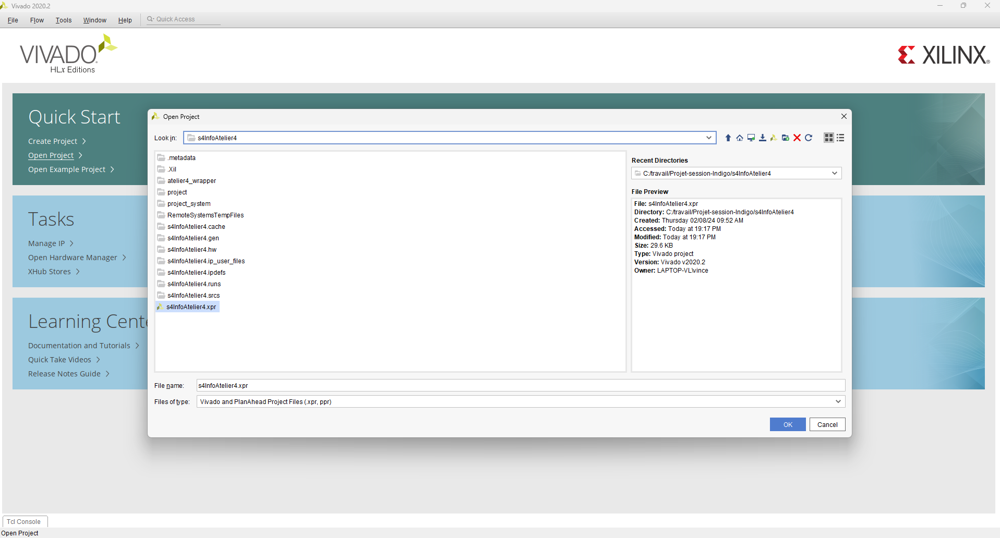
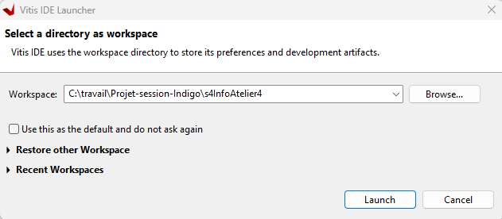

## Tutoriel 1 - Mise en marche de l'affichage
L'atelier 4 nous sert de point de départ pour le projet de l'équipe indigo, afin d'avoir une base fonctionnel pour bien débuter le projet.


## Matériel nécéssaire

| Nom                       | Quantité |
| ------------------------- | -------- |
| FPGA Zybo Z7              | 1        |
| Écran avec HDMI IN        | 1        |
| Câble HDMI                | 1        |
| Câble d'alimentation FPGA | 1        |

---
## Étape 1 : Ouverture dans Vivado
Suite à l'ouverture de Vivado, il faudra choisir le bon répertoire avec le `.xpr` , qui devrais se retrouver sous le cheminement suivant :
```
C:\travail\Projet-session-Indigo\s4InfoAtelier4
```

Une fois l'application Viviado d'ouverte, tout de suite ouvrir Vitis à partir du menu dans le coin à gauche :
```
Tools >> Lauch Vitis IDE
```


Une fois lancé une fenêtre vas apparaître pour choisir le répertoire de travail, assurez-vous de bien prendre le même que celui vivado soit :

```
C:\travail\Projet-session-Indigo\s4InfoAtelier4
```


Une fois le bon répertoire sélectionné, cliquez sur lauch et attendez que le programme se télécharge.

### ATTENTION

Si le programme prend trop de temps à se charger, suivez les étapes suivantes :

```
1. Ouvrez task manager
2. Clique droit sur "eclipse.exe"
3. Cliquez sur end task.
4. Recommencez l'ouverture de Vitis à partir de Vivado
```

---
## Étape 2 : Rouler le code et afficher à l'écran

**Assurez-vous que le FPGA est bien connecter et mis à "ON"et que câble HDMI soit bien mis sur l'entré "HDMI TX" du FPGA.**

Sur l'application Vitis, il faudra construire le projet en allant dans le menu suivant :
```
Project >> Build All
```


Une fois appuyé le projet débutera le build, il faudra attendre la fin du build :


Il ne restera plus qu'à lancer le projet en cliquant sur la flèche verte et en lançant le débugger par défaut : 


Le FPGA est senser se programmer et l'écran devrait afficher l'image suivante :

